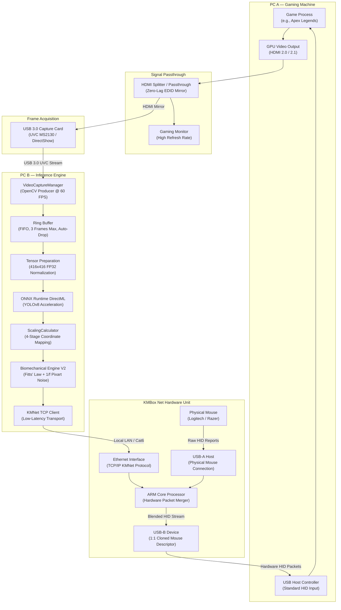
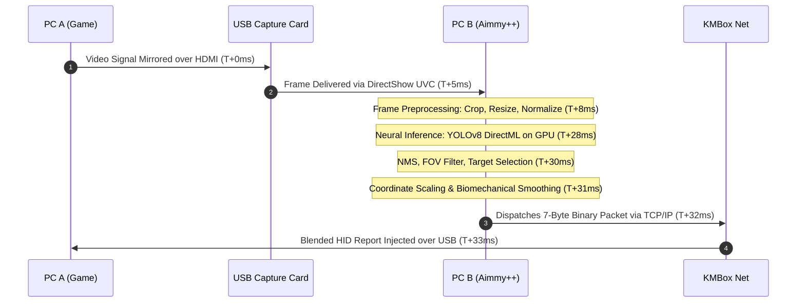

# Aimmy++

[](Aimmy2/Aimmy2.csproj)
[](https://dotnet.microsoft.com/)
[](https://onnxruntime.ai/)
[](https://github.com/HUGMAHE/Aimmyplusplus)
[](LICENSE)

Aimmy++ is an out-of-band, dual-machine computer vision aim alignment framework. It eliminates in-guest process hooks, local memory reads, and synthetic OS mouse events by offloading screen capture and neural inference to a secondary computer, piping aim adjustments through dedicated physical hardware (KMBox Net) that clones your primary mouse at the USB descriptor level.

---

## Table of Contents

- [Architectural Overview](#architectural-overview)
- [How It Works: End-to-End Pipeline](#how-it-works-end-to-end-pipeline)
- [Hardware Architecture & Bill of Materials](#hardware-architecture--bill-of-materials)
- [Biomechanical Movement Model (V2 Mitigations)](#biomechanical-movement-model-v2-mitigations)
- [Performance Benchmarks & Resolution Calibration](#performance-benchmarks--resolution-calibration)
- [Installation and Build Guide](#installation-and-build-guide)
- [Configuration and Setup](#configuration-and-setup)
- [Lineage and Acknowledgements](#lineage-and-acknowledgements)
- [Repository Operations](#repository-operations)

---

## Architectural Overview

Traditional computer-vision tools execute on the gaming host, capture frames through desktop duplication APIs, and inject synthetic cursor events via Win32 calls (`mouse_event` or `SendInput`). These vectors expose detectable flags (`LLMHF_INJECTED`) and suspicious render context handles.

Aimmy++ operates completely out-of-band:



### Physical Isolation Guarantees

1. **Host Integrity**: The gaming PC runs zero inspection code, zero background utilities, and zero virtual drivers.
2. **Transparent USB Stack**: The host sees only one physical device whose Vendor ID (VID), Product ID (PID), polling rate, and HID Report Descriptor match your primary mouse.
3. **Physical Packet Blending**: User movements pass directly through the hardware processor. AI delta corrections are merged in hardware without interrupting native polling.

---

## How It Works: End-to-End Pipeline

The processing loop runs cyclically from frame grab to physical HID packet dispatch within a 30 to 33 millisecond budget.



### Processing Stages

1. **Capture Worker (`VideoCaptureManager.cs`)**:
   Runs a dedicated high-priority acquisition thread using OpenCV over DirectShow. Extracted frames enter a thread-safe ring buffer (`MAX_QUEUE_SIZE = 3`). If the consumer lags, old frames drop automatically, guaranteeing zero latency drift.

2. **Tensor Preprocessing (`AIManager.cs`)**:
   Converts raw BGR buffers into planar float arrays normalized to `[0.0, 1.0]`. Dimensions are resized to the configured model resolution (416x416 recommended).

3. **Inference Execution (`AIManager.cs`)**:
   Evaluates YOLOv8 tensor operations using ONNX Runtime with DirectML execution providers, making efficient use of AMD and NVIDIA GPUs.

4. **Coordinate Scaling (`ScalingCalculator.cs`)**:
   Transforms model coordinates into screen movement deltas across three distinct physical spaces:
   - Capture Resolution (e.g., 1280x720)
   - Game Viewport Resolution (e.g., 1920x1080, stretched 4:3, or custom aspect ratios)
   - Host Native Display Resolution (e.g., 2560x1440)

5. **Biomechanical Synthesis (`Aimmy2/AILogic/Behavioral/`)**:
   Applies kinematic filtering, physiological tremor, adaptive reaction delays, and log-normal aim variance.

6. **Network Delivery (`KMNetClient.cs` / `KMNetProtocol.cs`)**:
   Encodes the calculated offset into a 7-byte binary frame (`Command`, `DeltaX`, `DeltaY`, `Buttons`, `Checksum`) and dispatches it over TCP/IP to the KMBox Net.

7. **Hardware Blending**:
   The onboard ARM core inside the KMBox Net merges incoming network deltas with raw physical mouse inputs and transmits the combined report to the gaming PC via USB.

---

## Hardware Architecture & Bill of Materials

### Required Hardware

| Component | Function | Requirements / Notes | Procurement Links |
|---|---|---|---|
| **KMBox Net** | Hardware HID Injection | ARM microcontroller, dual USB ports, 100M RJ45 Ethernet port. Supports custom descriptor spoofing. | [AliExpress KMBox Net](https://www.aliexpress.com/w/wholesale-kmbox-net.html) |
| **USB 3.0 HDMI Capture Card** | Video Stream Acquisition | Low-latency UVC compliant, MS2130 or equivalent chipset, 1080p60 / 720p60 support without proprietary drivers. | [Amazon USB 3.0 MS2130](https://www.amazon.fr/s?k=capture+card+usb+3.0+ms2130) / [Elgato Cam Link 4K](https://www.amazon.fr/s?k=elgato+cam+link+4k) |
| **HDMI Passthrough Splitter** *(Optional)* | Monitor Cloning | Required if GPU lacks an independent mirrored video output. Must support 144Hz+ EDID passthrough. | [Amazon Ezcoo Splitter](https://www.amazon.fr/s?k=ezcoo+hdmi+splitter) |
| **Ethernet Cable** | Network Communication | Cat 5e or Cat 6 cable connecting KMBox Net to local network switch or PC B. | Standard RJ45 cable |
| **USB Cables** | Host & Device Hookup | 2x USB cables (typically supplied with the KMBox Net unit). | Included with device |
| **Gaming Mouse** | Donor Device | Mouse whose hardware identity is cloned (Logitech G Pro, Razer DeathAdder, etc.). | Existing hardware |
| **USBTreeView Utility** | Descriptor Extraction | Windows utility to inspect and export full hex HID Report Descriptors. | [Download USBTreeView](https://www.uwe-sieber.de/usbtreeview_e.html) |

---

## Biomechanical Movement Model (V2 Mitigations)

Server-side anti-cheat telemetry analyses aim vector kinematics. Standard PRNG (pseudo-random number generator) jitter and linear mathematical curves exhibit clear synthetic characteristics. Aimmy++ implements four specialized biological emulation layers:

```mermaid
flowchart LR
    InDelta["Target Coordinate Delta (dx, dy)"] --> Model["HumanAimingModel\n(Approach -> Overshoot -> Micro-Pause -> Correct)"]
    Model --> Bias["AimBiasProfile\n(Log-Normal Individual Spatial Offset)"]
    Bias --> Merger["MovementMerger\n(60/30/10 Hit Distribution Allocation)"]
    Merger --> Noise["SensorNoiseInjector\n(1/f Correlated Drift + 8-12Hz Tremor)"]
    Noise --> Reaction["HumanReactionSimulator\n(Fitts' Law Variable Latency: 100-400ms)"]
    Reaction --> Kalman["PredictionManager\n(Kalman Filter Motion Extrapolation)"]
    Kalman --> Out["KMNet Client Outbound Packet"]
```



### 1. `SensorNoiseInjector.cs`
Physical optical sensors (e.g., PixArt PAW3395) do not produce Gaussian white noise. Surface imperfections, microscopic dust, and hand tilt create temporally correlated 1/f noise:
- Random-walk positional drift with elastic snap-back.
- Physiological hand tremor modeled as an 8–12 Hz sinusoidal oscillator.
- Diagonal directional cross-coupling between X and Y axes.

### 2. `HumanReactionSimulator.cs`
Fixed delays (e.g., exactly 150 ms) fail statistical variance tests. Aimmy++ applies **Fitts' Law**:

$$\text{MT} = a + b \cdot \log_2\left(\frac{2D}{W} + 1\right)$$

Where $D$ is target distance and $W$ is target bounding box size. Base reaction time is sampled from a physiological Gaussian distribution ($200\text{ ms} \pm 40\text{ ms}$), constrained strictly between 100 ms and 400 ms with natural biological outliers.

### 3. `HumanAimingModel.cs`
Human ballistic corrections follow distinct kinetic phases:
- **Approach**: High-velocity initial acceleration.
- **Overshoot**: Natural target over-travel scaled by distance.
- **Micro-Pause**: Neurological evaluation delay (50–100 ms zero-movement window).
- **Correction**: Inverse convergence towards center mass.
- **Tracking**: Micro-saccadic tracking loop.

### 4. `AimBiasProfile.cs`
Automated aimbots cluster symmetrically around the exact mathematical center of targets. Real players maintain persistent individual spatial biases (e.g., drifting slightly high-right). The profile applies an asymmetrical, log-normal distribution to match human shooting heatmaps.

---

## Performance Benchmarks & Resolution Calibration

Testing conducted on an AMD Ryzen AI 9 365 host with integrated AMD Radeon 880M graphics (RDNA 3.5 architecture, 32 GB shared LPDDR5X memory).

### Inference vs. Total Cycle Latency

| Input Size | Inference Latency | Pipeline Total | Effective Rate | Assessment |
|---|---|---|---|---|
| **640x640** | 50 - 55 ms | 64 - 69 ms | ~14 FPS | Unusable for real-time tracking |
| **512x512** | 32 - 38 ms | 46 - 52 ms | ~20 FPS | Acceptable precision, slight input lag |
| **416x416** | **20 - 22 ms** | **28 - 33 ms** | **~30 FPS** | **Optimal balance (recommended)** |
| **320x320** | 13 - 15 ms | 24 - 26 ms | ~38 FPS | Maximum speed, reduced long-range accuracy |

### Latency Budget Breakdown (at 416x416)

```
Capture Card Transfer      [████░░░░░░░░░░░░░░░░░░░░]  5.0 ms
Frame Normalization & Crop [██░░░░░░░░░░░░░░░░░░░░░░]  3.0 ms
YOLOv8 DirectML Inference  [████████████████░░░░░░░░] 20.0 ms
NMS & Coordinate Scaler    [█░░░░░░░░░░░░░░░░░░░░░░░]  1.5 ms
Biomechanical Simulation   [█░░░░░░░░░░░░░░░░░░░░░░░]  1.5 ms
KMNet Ethernet Dispatch    [░░░░░░░░░░░░░░░░░░░░░░░░]  0.5 ms
Hardware HID Injection     [█░░░░░░░░░░░░░░░░░░░░░░░]  1.0 ms
----------------------------------------------------------------
TOTAL END-TO-END PIPELINE                             32.5 ms
```

> **Calibration Note**: Configure `Image Size` to `416` in the Settings panel for ~20 ms GPU inference without requiring high-end dedicated graphics cards.

---

## Installation and Build Guide

### Prerequisites (PC B — Inference Machine)

- Windows 10 or Windows 11 (64-bit)
- [.NET 8.0 SDK](https://dotnet.microsoft.com/download/dotnet/8.0)
- Up-to-date AMD Adrenalin or NVIDIA Display Drivers
- Visual Studio 2022 (with *.NET Desktop Development* workload) or the .NET CLI

### Building from Source

Open a PowerShell terminal in the repository directory:

```powershell
# Restore NuGet dependencies
dotnet restore Aimmy2/Aimmy2.csproj

# Compile release binary
dotnet build Aimmy2/Aimmy2.csproj -c Release
```

The output executable is compiled into:
`Aimmy2/bin/Release/net8.0-windows/YmmiaV2.exe`

---

## Configuration and Setup

### 1. Hardware Connection
1. Connect physical mouse to **USB-A** on the KMBox Net.
2. Connect **USB-B** from KMBox Net to your gaming machine (PC A).
3. Connect **RJ45** from KMBox Net to your network switch or PC B.
4. Route HDMI signal from PC A into the USB 3.0 capture card on PC B.

### 2. Software Calibration
1. Launch **Aimmy++** on PC B.
2. Navigate to **Screen Settings**:
   - Select your capture device from the DirectShow device dropdown.
   - Set **KMNet IP** (default: `192.168.1.100`) and **KMNet Port** (default: `6721`).
   - Click **Connect KMBox** to open the socket.
3. Open **Resolution Calibration**:
   - Set **Capture Resolution** to card output (e.g., `1280` x `720`).
   - Set **Game Resolution** to active game render size (e.g., `1920` x `1080`).
   - Set **Native Screen Resolution** to gaming monitor specs (e.g., `1920` x `1080`).
   - Click **Apply Calibration**.
4. In **Aim Config**:
   - Enable behavioral toggles: *Hit Distribution Variance*, *Reaction Delay*, and *Lead Time Variance*.
   - Load the relevant ONNX model for your target game.

---

## Lineage and Acknowledgements

- **Base Project**: [Babyhamsta/Aimmy](https://github.com/Babyhamsta/Aimmy) (V2 branch) — Initial DirectML ONNX inference architecture and UI foundations.
- **Behavioral Kinematics Reference**: [sarperavci/human_mouse](https://github.com/sarperavci/human_mouse) — Trajectory interpolation research and spline analysis.
- **Architectural Fork**: Aimmy++ replaces in-guest screen scraping and synthetic Win32 mouse injection with dual-system physical isolation, DirectShow hardware capture, 4-stage resolution calibration, and KMBox Net network injection.
---

## License

This project is licensed under Source-Available terms for educational, accessibility, and computer vision research purposes. Refer to the [LICENSE](LICENSE) file for complete distribution terms.
